# AICP Canonical Flows and State Machines (M8.4)

This catalog provides implementer-oriented canonical message flows and state machines for AICP Core and key extensions.

## How to read these flows
- **Sequence diagrams** show the typical message exchange order across participants.
- **State diagrams** show lifecycle checkpoints and transition conditions.
- **Normative notes** under each diagram call out interoperability-critical invariants.
- **Executable counterpart:** these diagrams are paired with conformance suites and fixtures; use those artifacts as the source of machine-verifiable behavior.

---

## 2.1 Core Happy Path (signed transcript)

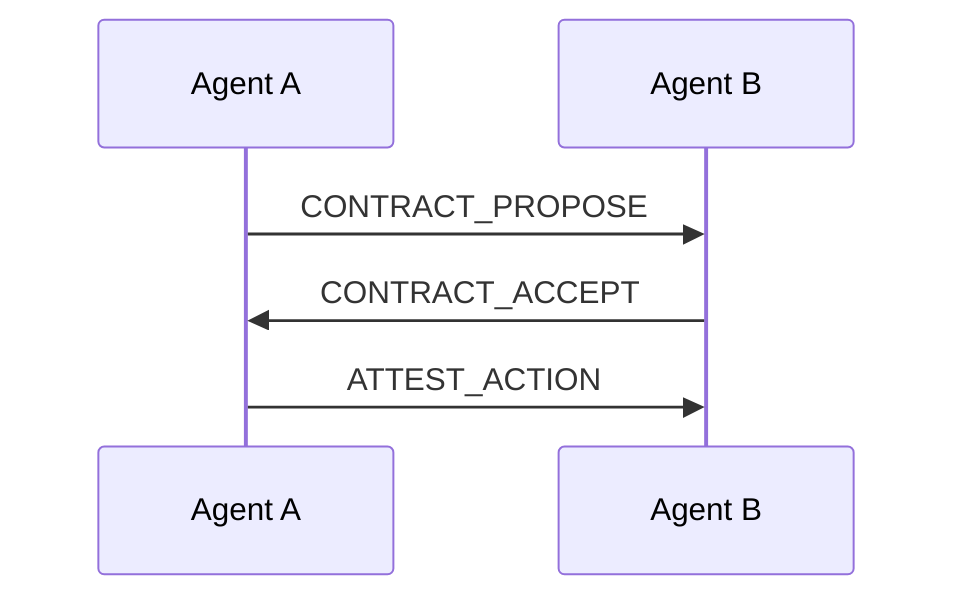

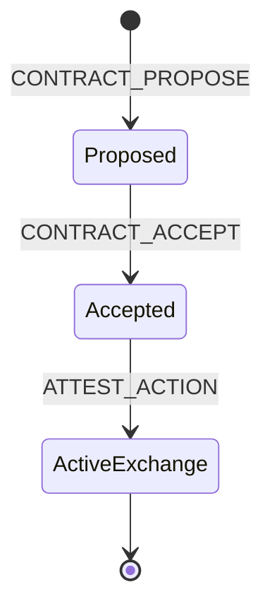

Normative notes:
- Messages in the transcript MUST form a valid hash chain (`prev_msg_hash` references prior `message_hash`).
- `message_hash` MUST recompute from message body.
- Where signatures are present and verification is enabled, signatures SHOULD verify against known public keys.

Conformance reference: `conformance/core/CT_CORE_0.1.json`; fixtures: `fixtures/golden_transcripts/`.

---

## 2.2 Capability Negotiation (EXT-CAPNEG)

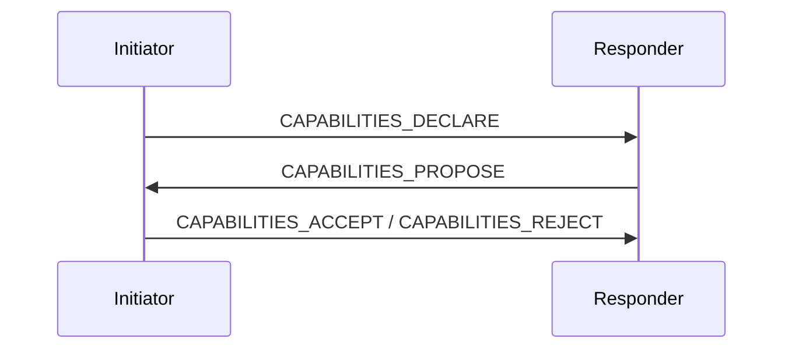

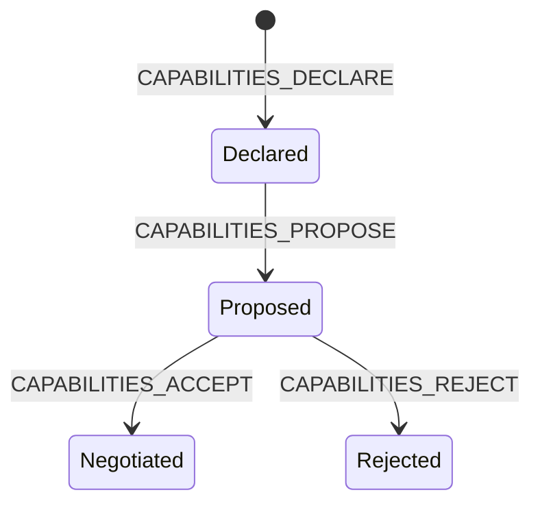

Normative notes:
- Conceptually this is request/response-style capability negotiation, represented by `DECLARE` + `PROPOSE` + terminal `ACCEPT`/`REJECT` messages.
- Implementations SHOULD prevent downgrade by binding accepted profile/capabilities to negotiated context.

Conformance reference: `conformance/extensions/CN_CAPNEG_0.1.json`; fixtures: `fixtures/extensions/capneg/`.

---

## 2.3 Policy Evaluation (EXT-POLICY-EVAL)

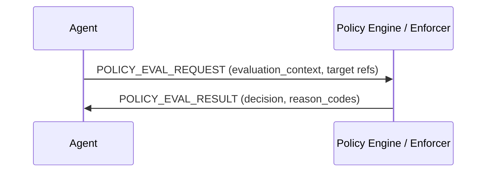

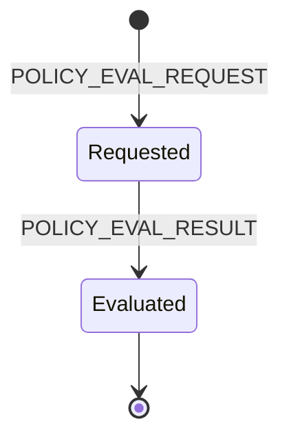

Normative notes:
- The request binds what is being evaluated via context and target references.
- Result decisions and reason codes MUST be machine-checkable against registry-defined reason codes.

Conformance reference: `conformance/extensions/PE_POLICY_EVAL_0.1.json`; fixtures: `fixtures/extensions/policy_eval/`.

---

## 2.4 Mediated Blocking Enforcement (EXT-ENFORCEMENT)

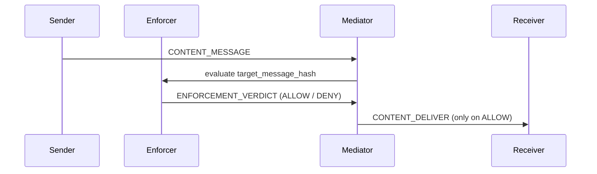

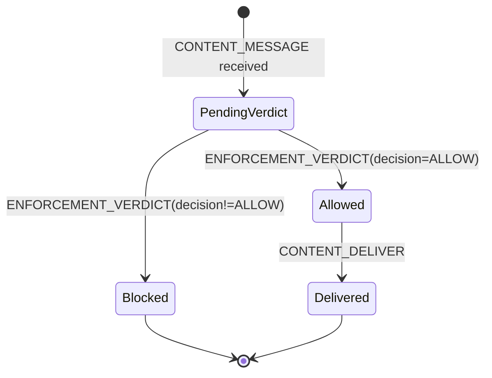

Normative notes:
- In blocking mode, mediator MUST NOT emit `CONTENT_DELIVER` without an `ALLOW` verdict.
- Verdict binding MUST be consistent: `target_message_hash` in verdict matches delivered `original_message_hash`.

Conformance reference: `conformance/extensions/ENF_ENFORCEMENT_0.1.json`; fixtures: `fixtures/extensions/enforcement/`.

---

## 2.5 Operational Alerts (EXT-ALERTS)

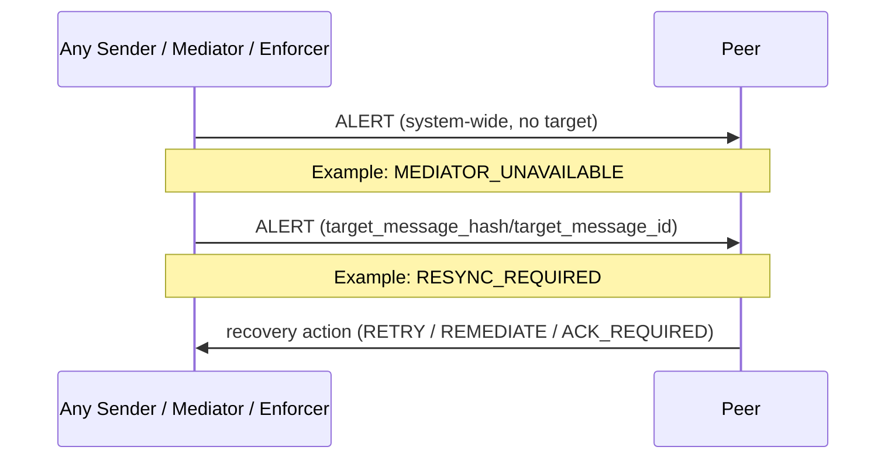

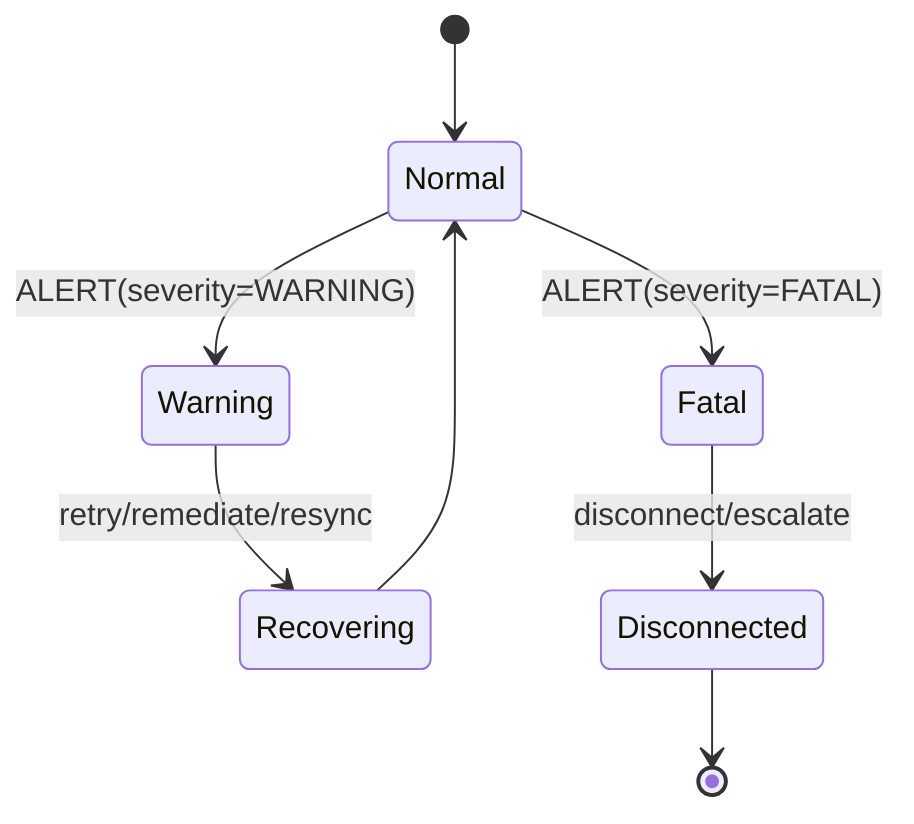

Normative notes:
- `ALERT.code` MUST be registered in `registry/alert_codes.json`.
- Each entry in `recommended_actions` MUST be registered in `registry/alert_recommended_actions.json`.
- Target fields are optional for system-wide alerts and provide binding when present.

Conformance reference: `conformance/extensions/AL_ALERTS_0.1.json`; fixtures: `fixtures/extensions/alerts/`.

---

## 2.6 Object Resync (EXT-OBJECT-RESYNC)

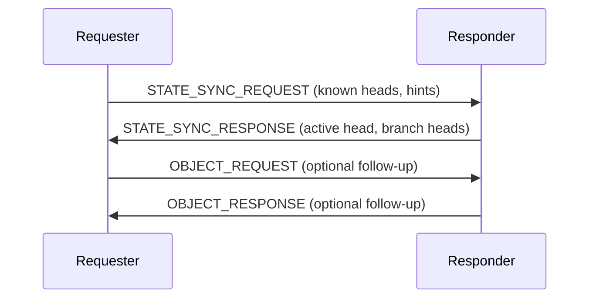

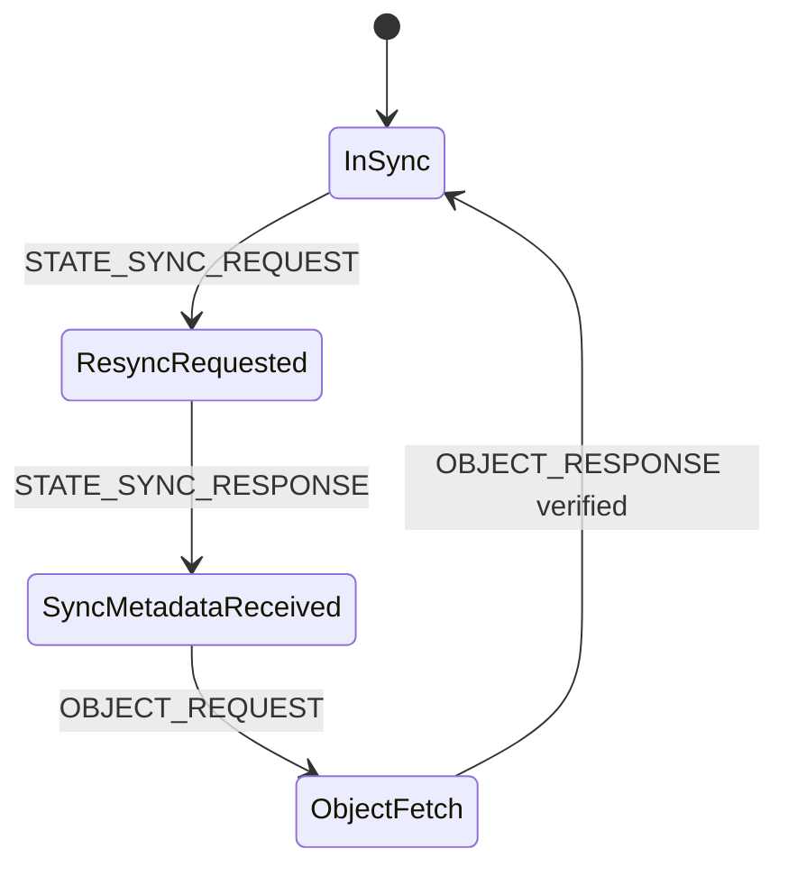

Normative notes:
- Sync exchange SHOULD minimize unauthorized state disclosure (minimize leakage).
- This flow commonly pairs with alerts (e.g., `RESYNC_REQUIRED`) to trigger deterministic recovery.

Conformance reference: `conformance/extensions/OR_OBJECT_RESYNC_0.1.json`; fixtures: `fixtures/extensions/object_resync/`.

---

## 2.7 MCP Binding (BIND-MCP)

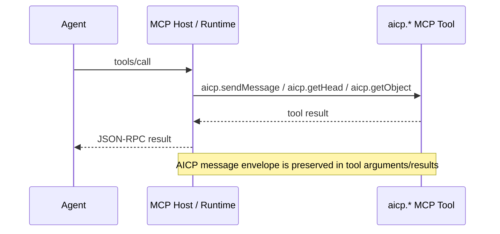

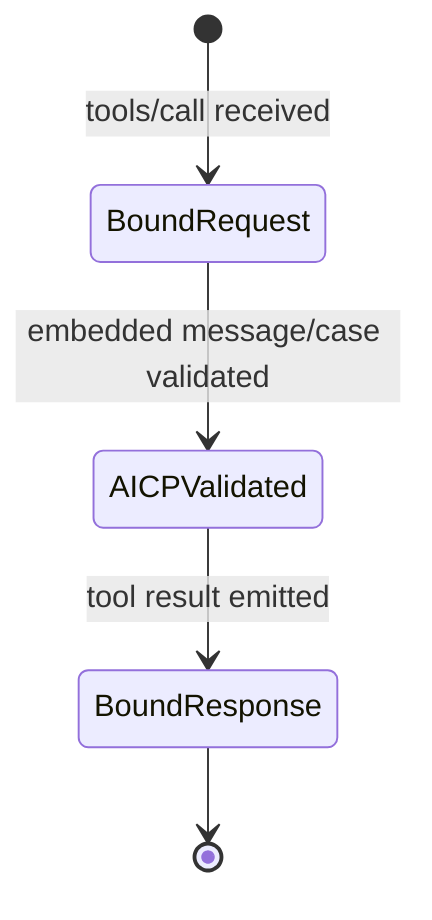

Normative notes:
- Binding maps host-mediated tool invocations to AICP operations without changing Core message semantics.
- Embedded AICP messages MUST remain schema/hash consistent with canonical envelope expectations.

Conformance reference: `conformance/bindings/TB_MCP_0.1.json`; fixtures: `fixtures/bindings/mcp/`.

---

## 2.8 Resume / Reconnect (EXT-RESUME)

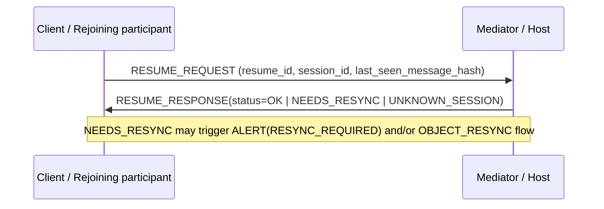

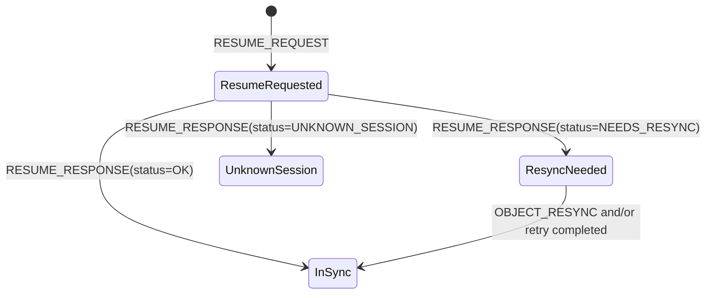

Normative notes:
- `RESUME_RESPONSE` MUST match request `resume_id` and `session_id`.
- `status=OK` implies `current_head_hash == last_seen_message_hash`.
- `status=NEEDS_RESYNC` implies `current_head_hash != last_seen_message_hash` and should drive deterministic recovery.

Conformance reference: `conformance/extensions/RS_RESUME_0.1.json`; fixtures: `fixtures/extensions/resume/`.

## Behavioral enforcement demo pointer
- Deterministic demo transcripts and threat-driven expected-fail cases are available under `demos/enforcement_behavioral/`.
- Canonical machine-verifiable fixtures are in `fixtures/demos/enforcement_behavioral/` and suite catalog `conformance/demos/DEMO_ENFORCEMENT_BEHAVIORAL_0.1.json`.

